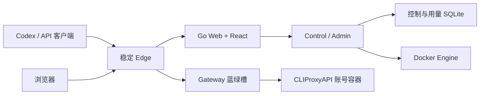

<div align="center">
  <picture>
    <source media="(prefers-color-scheme: dark)" srcset="./docs/assets/codex-cpa-pool-mark-dark.svg">
    
  </picture>

  <h1>Codex CPA Pool</h1>

  <p>
    自托管的多账号 CLIProxyAPI 控制平面、稳定网关与用量中心。<br>
   </p>

  <p>
    简体中文 · <a href="./README.en.md">English</a>
  </p>

  <p>
    <a href="https://github.com/Alfonsxh/codex-cpa-pool/releases/latest"></a>
    <a href="https://github.com/Alfonsxh/codex-cpa-pool/actions/workflows/ci.yml"></a>
    
    <a href="./LICENSE"></a>
    <a href="https://t.me/codex_ccpa"></a>
  </p>

  <p>
    <a href="#quick-start">快速开始</a> ·
    <a href="#features">核心能力</a> ·
    <a href="#architecture">运行架构</a> ·
    <a href="#documentation">文档</a> ·
    <a href="./CONTRIBUTING.md">参与贡献</a>
  </p>

  
  <p><sub>深色模式 · 演示数据，非真实账号与用量</sub></p>
</div>

**Codex CPA Pool** 将多个 [CLIProxyAPI](https://github.com/router-for-me/CLIProxyAPI) 账号统一到一个入口，为成员分配独立 API Key 和周额度，并集中查看用量。适用于团队共享或个人多账号管理。

<a id="quick-start"></a>

## 快速开始

下载安装脚本并执行，运行前可以先检查脚本内容：

```sh
curl -fsSLO https://github.com/Alfonsxh/codex-cpa-pool/releases/latest/download/run.sh
sudo sh run.sh
```

首次设置见[快速开始](./docs/getting-started.md)，已有环境见[升级指南](./docs/upgrade.md)。

<a id="features"></a>

## 核心能力

| 能力 | 说明 |
| --- | --- |
| 多账号管理 | 管理 CPA 账号、OAuth 授权、运行状态与故障迁移 |
| 用户与团队 | 隔离外部 API Key 和上游内部 Key，支持用户、团队和账号绑定 |
| 额度与用量 | 采集请求 Token，展示账号及用户趋势，导出团队、账号和个人 XLSX 周报，并执行周额度策略 |
| 稳定数据面 | Edge 固定入口，Gateway 蓝绿切换，已有 SSE 请求不中断、不重放 |
| 安全升级 | 升级前生成一致性 SQLite 备份，校验不可变镜像并保留现有 Key、OAuth 和路由 |
| Web 管理 | 提供管理中心、用户 Portal、个人使用中心和首次配置流程 |

<table>
  <tr>
    <td width="50%" align="center"><br><sub>账号管理</sub></td>
    <td width="50%" align="center"><br><sub>用量分析</sub></td>
  </tr>
</table>

<a id="architecture"></a>

## 运行架构



部署包含 Control、Web、Gateway、Edge 四类镜像。控制数据与用量分别存储，Gateway 读取鉴权、额度和路由快照。详见[架构](./docs/architecture.md)。

<a id="documentation"></a>

## 文档

| 文档 | 内容 |
| --- | --- |
| [快速开始](./docs/getting-started.md) | 安装、首次设置和后续操作 |
| [架构](./docs/architecture.md) | 服务拓扑、数据所有权、请求链路与蓝绿切换 |
| [部署](./docs/deployment.md) | 目录、入口、部署前提与验收 |
| [多语言](./docs/internationalization.md) | 英文默认、接口语言协商、报表与通知语言 |
| [配置中心](./docs/configuration-center.md) | 邮箱、额度、通知、品牌和上游代理配置 |
| [升级](./docs/upgrade.md) | 备份、升级、验收与回滚边界 |
| [备份与恢复](./docs/backup-and-restore.md) | SQLite、主密钥、OAuth 和账号配置恢复 |
| [故障排查](./docs/troubleshooting.md) | 常见部署、网关、账号和用量问题 |
| [开发指南](./docs/development.md) | 本地开发、验证工具链与测试约定 |
| [Telegram 发布通知](./docs/telegram-release.md) | 正式版公告配置、模板与回执 |
| [更新日志](./CHANGELOG.md) | 面向使用者的版本变更记录 |

## 本地开发

```sh
npm ci --prefix frontend
npm ci --prefix tools/openapi
make -f scripts/build.mk verify
```

## License

[MIT License](./LICENSE)
